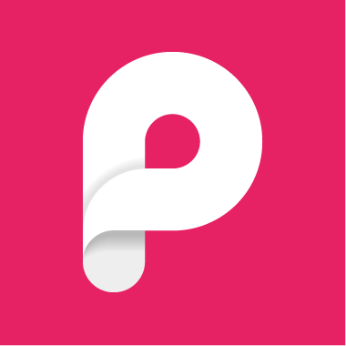
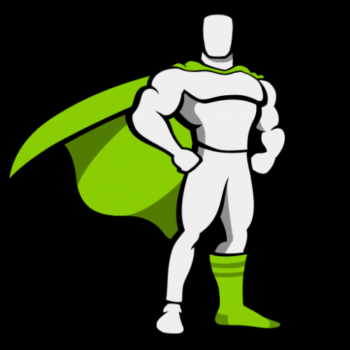

<h2>
Hello everyone, feel free, check out my repositories and stay hydrated &#129380  &#128540
</h2>

  
  
  

 
      <!--       -->
      
   
                
   <!--     
        
    -->
    
                     
        <!--         -->
            
            
        
         <!--    -->
        <!--           -->
            <!--               -->
             <!--         -->   
    
        
                       
  </a>

